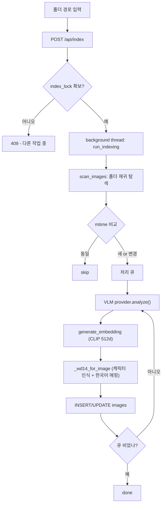

# Taggu

로컬에서 돌아가는 한국어 이미지 자동 태깅 + 의미 검색 도구.

이미지 폴더를 인덱싱하면 각 이미지에 한국어 태그·설명·캐릭터·시각 임베딩을 붙이고, 브라우저에서 한국어로 검색한다. AI 분석은 로컬 GPU(Qwen2.5-VL)로도, OpenAI/Anthropic/Gemini API로도 돌릴 수 있다.

   

- 플랫폼: Windows 전용
- 사용 형태: 단일 사용자, 로컬 실행
- 데이터: DB·이미지·인덱스 전부 로컬 디스크에 저장 (클라우드 의존 없음)

## 목차

- [개요](#개요)
- [기능](#기능)
- [아키텍처](#아키텍처)
- [데이터 파이프라인](#데이터-파이프라인)
- [기술 스택](#기술-스택)
- [설치](#설치)
- [사용법](#사용법)
- [API 레퍼런스](#api-레퍼런스)
- [트러블슈팅](#트러블슈팅)
- [비슷한 도구](#비슷한-도구)
- [한계](#한계)
- [라이선스](#라이선스)

## 개요

오래 모은 짤·이미지·스크린샷 폴더는 양이 많아지면 뭐가 어디 있는지 못 찾는다. Taggu는 그 폴더를 한 번 인덱싱해서 이미지마다 검색 가능한 메타데이터를 만들어 둔다.

인덱싱 한 장당 세 가지 분석이 동시에 돈다.

- **WD14 (ONNX, CPU)** — 애니/만화 캐릭터·작품 인식. `character_aliases.json`으로 영어 캐릭터명을 한국어로 매핑.
- **Qwen2.5-VL (GPU 또는 API)** — 한국어 태그 5~10개 + 한 줄 설명 생성.
- **CLIP ViT-B/32** — 512차원 시각 임베딩. 유사 이미지 검색에 사용.

결과는 SQLite(WAL 모드)에 저장하고, 브라우저 UI에서 검색·태그 편집·즐겨찾기 등을 한다.

설계 기준:

- **로컬 우선** — 외부 서비스 없이 본인 PC에서 완결.
- **한국어 일관** — UI·태그·에러 메시지·단축키 전부 한국어.
- **단일 사용자** — 인증·공유·멀티테넌트 없음. LAN의 다른 기기에서 접속은 되지만 권한 분리는 없다.
- **점진적 인덱싱** — 폴더를 다시 추가하면 mtime을 비교해 변경분만 처리.

## 기능

### 자동 태깅 (3계층)

한 이미지에 WD14(캐릭터) + VLM(한국어 태그·설명) + CLIP(시각 임베딩) 세 결과를 합쳐 하나의 검색 인덱스로 저장한다. 대략적인 처리 속도는 WD14 ~0.5초/장, VLM ~2~5초/장.

### 검색 (3종)

| 모드 | 트리거 | 동작 |
|---|---|---|
| 텍스트 검색 | 검색창 입력 + Enter | WD14/태그/설명/내 태그 텍스트에 부분 매치. 한국어 IME 중복 검색 가드 포함 |
| 랜덤 | `R` 키 또는 랜덤 버튼 | 5장 무작위 표시 |
| 유사 이미지 | 모달의 유사 이미지 버튼 | CLIP 코사인 유사도 상위 K개 |

### 태그 편집

- 칩을 드래그해 다른 분류로 이동 (내 태그 / 캐릭터 / AI 세 필드 사이 6방향).
- 칩 더블클릭으로 인라인 편집.
- 칩의 제거 버튼으로 삭제.
- Ctrl+클릭 / Shift+클릭으로 다중 선택 후 즐겨찾기·숨김·태그 일괄 추가.

### 유튜브 짤 생성

툴바의 [유튜브 짤]에서 유튜브 영상을 바로 짤로 만든다. 두 모드:

- **GIF (구간)** — 시작·끝 시간을 주면 그 구간을 GIF로.
- **JPEG (한 컷)** — 시간 하나만 주면 그 순간을 캡처해 JPEG로.

만든 짤은 등록 폴더 안 `유튜브짤/`에 저장되고, 증분 인덱싱으로 곧바로 검색 대상이 된다. `yt-dlp`와 `imageio-ffmpeg`가 `requirements.txt`에 포함돼 venv에 자동 설치되며(winget 불필요), 그래도 없으면 버튼이 비활성화되고 설치 안내가 뜬다 — 검색·태깅 본체와는 분리.

## 아키텍처

```
브라우저 (Edge/Chrome --app 모드)
  vanilla HTML/CSS/JS — 검색·그리드·모달·일괄작업·드래그 태깅·설정
        │  HTTP / HTTPS (LAN)
        ▼
FastAPI (Uvicorn)
  /api/index, /api/search, /api/random, /api/similar/{id},
  /api/image/{id}/{state|tags|move_tag|field_tags},
  /api/settings (GET/POST/test), /api/info ...
        │
        ├── providers.py      VLMProvider 추상화 + LocalQwen / OpenAI / Anthropic / Gemini
        ├── index.py + wd14    WD14 ONNX, CLIP, scan/embedding/backfill/index_folder
        └── SQLite (WAL)       images / folders 테이블, schema 자동 마이그레이션
```

### 디렉토리 구조

```
Taggu/
├── app.py                  # FastAPI 서버 + 모든 엔드포인트
├── index.py                # 인덱싱/백필/CLIP/디덥 헬퍼
├── providers.py            # VLMProvider 추상화 + 4종 구현
├── wd14_tagger.py          # WD14 ONNX 로더 + 한국어 alias 매핑
├── desktop.py              # dev 모드 데스크톱 런처 (subprocess + Edge)
├── taggu_main.py           # 패키지 모드 단일 프로세스 런처
├── tray_launcher.py        # 시스템 트레이 런처
├── make_icon.py            # 아이콘 생성/캐싱
├── templates/index.html    # 프론트엔드 전체 (HTML+CSS+JS)
├── character_aliases.json  # WD14 영어 캐릭터 → 한국어 매핑
├── docs/                   # 한국어 설계 문서
├── settings.json           # AI provider 설정 (gitignore, 첫 실행 시 자동 생성)
├── images.db               # SQLite (gitignore)
├── taggu.spec              # PyInstaller 스펙
├── build.bat               # 패키지 빌드
└── requirements.txt
```

## 데이터 파이프라인

### 인덱싱



### 텍스트 검색

각 이미지의 `wd_chars_ko + tags + description + user_tags`를 소문자로 합친 문자열에, 검색어를 공백으로 나눈 모든 토큰이 포함되는지 본다. 매치된 항목은 `1 + 매치 길이`로 점수를 매겨 내림차순 정렬 후 상위 N개를 반환한다.

### 유사 이미지

대상 이미지의 CLIP 임베딩과 전체 이미지 임베딩의 코사인 유사도(L2 정규화 벡터의 내적)를 계산해 자기 자신을 뺀 상위 K개를 반환한다.

### 태그 이동 (atomic)

드래그로 태그를 옮기면 `POST /api/image/{id}/move_tag {tag, source, target}`가 출발 필드에서 제거하고 도착 필드에 추가(중복 제거)한 뒤, 갱신된 세 필드 배열을 한 번에 반환한다. 프론트는 그리드와 모달을 동시에 갱신한다.

## 기술 스택

| 계층 | 선택 | 이유 |
|---|---|---|
| VLM (로컬) | Qwen2.5-VL-7B-Instruct | 한국어 태깅. 멀티모달. 4bit 양자화 옵션 |
| VLM (API) | OpenAI / Anthropic / Gemini | GPU 없이 동작. SDK는 lazy import |
| 양자화 | bitsandbytes nf4 + double quant | 16GB → 약 5.5GB VRAM (Windows + Python 3.13에서 autoawq 대신 채택) |
| 임베딩 | CLIP ViT-B/32 (open_clip, laion2b) | 512d, 빠름 |
| 캐릭터 인식 | WD14 EVA02-Large (ONNX) | CPU 추론, 애니/만화 캐릭터 다수 학습 |
| DB | SQLite (WAL) | 단일 파일, 동시 read/write, 외부 의존 없음 |
| 웹 서버 | FastAPI + Uvicorn | async, Pydantic 검증 |
| 프론트엔드 | Vanilla HTML/CSS/JS | 빌드 단계 없음, 한 파일 |
| 데스크톱 래핑 | Edge / Chrome `--app` | Electron 없이 독립 창 |
| 패키징 | PyInstaller (onedir) | Python 미설치 사용자용 EXE |
| HTTPS (LAN) | mkcert 자체 서명 인증서 | LAN의 다른 기기에서 클립보드 API 사용 |

## 설치

세 가지 경로가 있다.

### A. 패키지된 EXE (가장 쉬움, GPU 불필요)

1. [Releases](https://github.com/vanillapapaya/Taggu/releases)에서 `Taggu-vX.X.X-mid.zip` 다운로드
2. 압축 해제
3. `Taggu.exe` 실행
4. 설정에서 Gemini/OpenAI 키 입력 후 저장
5. 폴더 인덱싱 시작

이 경로의 AI 분석은 API 모드만 가능하다. 로컬 GPU 모드는 B 또는 C로.

### B. 소스 실행 (전체 기능)

전제: Windows + Python 3.13 + NVIDIA GPU (RTX 30/40/50 시리즈)

```powershell
# uv 설치 (없다면)
winget install astral-sh.uv

git clone <repo>
cd Taggu
uv venv --python 3.13 .venv

# RTX 5080(Blackwell)은 nightly torch:
$env:VIRTUAL_ENV="$PWD\.venv"
uv pip install --index-url https://download.pytorch.org/whl/nightly/cu128 --pre torch torchvision

# 그 외 NVIDIA GPU:
# uv pip install --index-url https://download.pytorch.org/whl/cu124 torch torchvision

uv pip install -r requirements.txt

# LAN HTTPS를 쓰려면 mkcert 인증서:
# mkcert -install
# mkcert 192.168.0.75 127.0.0.1 ::1

.venv\Scripts\python.exe desktop.py
```

### C. API 전용 (CPU만)

```powershell
git clone <repo>
cd Taggu
uv venv .venv-cpu
$env:VIRTUAL_ENV="$PWD\.venv-cpu"
uv pip install --index-url https://download.pytorch.org/whl/cpu torch torchvision
uv pip install fastapi "uvicorn[standard]" jinja2 open-clip-torch Pillow onnxruntime huggingface_hub openai anthropic google-genai numpy
.venv-cpu\Scripts\python.exe app.py
```

실행 후 설정에서 API provider를 고른다.

### EXE 빌드

```powershell
uv venv .venv-build
$env:VIRTUAL_ENV="$PWD\.venv-build"
uv pip install --index-url https://download.pytorch.org/whl/cpu torch torchvision
uv pip install -r requirements.txt pyinstaller
.\build.bat
# 결과: dist\Taggu\Taggu.exe (onedir)
```

## 사용법

### 최초 1회

1. 설정 → 백엔드 선택 → (API면) 키 입력 → 테스트로 검증 → 저장
2. 관리 도구 토글 → 폴더 경로 입력 또는 폴더 고르기
3. 새 이미지 추가 → 진행률 확인 → 완료 대기

### 평소

- 검색: 검색창에 한국어 입력 후 Enter
- 랜덤 탐색: `R` 키
- 상세 보기: 카드 클릭 → 모달 → 좌/우 방향키 이동, Esc 닫기
- 즐겨찾기 / 숨김: 카드 hover 시 버튼
- 태그 편집: 모달에서 칩 더블클릭(편집) / 드래그(분류 이동) / 제거 버튼 / 입력란에 새 태그
- 일괄 작업: Ctrl+클릭 또는 Shift+클릭으로 선택 후 하단 bulk-bar
- 유사 이미지: 모달의 유사 이미지 버튼
- 복사: 카드 hover 시 복사 (로컬은 클립보드 직접, 원격은 다운로드)

### 단축키

| 키 | 동작 |
|---|---|
| Enter | 검색 / 폴더 인덱싱 |
| R | 랜덤 5개 |
| ← / → | 모달 이전/다음 |
| Esc | 모달 닫기 |
| Ctrl+클릭 | 다중 선택 |
| Shift+클릭 | 다중 선택 |
| Ctrl+F5 | 강제 새로고침 |

## API 레퍼런스

베이스: `https://localhost:8000` (또는 `http://`)

### 인덱싱 / 분석

| Method | Path | 설명 |
|---|---|---|
| POST | `/api/index` | `{path, reindex, with_ai}` 폴더 인덱싱 시작 (백그라운드) |
| POST | `/api/backfill_wd14` | WD14 누락분만 채움 |
| POST | `/api/backfill_vlm` | AI 한국어 태그/설명 누락분 채움 |
| POST | `/api/relocalize` | character_aliases 갱신 후 한국어 매핑 재적용 (재분석 안 함) |
| POST | `/api/dedupe_tags` | 모든 이미지의 중복 태그 정리 |
| GET | `/api/index/status` | 진행률 + 현재 상태 폴링 |

### 검색 / 브라우징

| Method | Path | 설명 |
|---|---|---|
| GET | `/api/search?q=&limit=&view=` | 텍스트 검색 (한국어 IME 안전) |
| GET | `/api/random?n=&view=` | 무작위 |
| GET | `/api/browse?offset=&limit=&view=` | 페이지네이션 브라우즈 |
| GET | `/api/similar/{id}?limit=&view=` | CLIP 유사 이미지 |
| GET | `/api/counts` | {all, favorite, hidden} |
| GET | `/api/info` | 전체 통계 |

### 이미지 상태 / 태그

| Method | Path | 설명 |
|---|---|---|
| POST | `/api/image/{id}/state` | `{favorite?, hidden?}` |
| POST | `/api/image/{id}/tags` | `{tags: list[str]}` user_tags 전체 갱신 |
| POST | `/api/image/{id}/field_tags` | `{field, tags}` 임의 필드 갱신 (dedupe) |
| POST | `/api/image/{id}/move_tag` | `{tag, source, target}` user/char/ai 6방향 atomic 이동 |
| POST | `/api/image/{id}/copy` | (로컬 only) OS 클립보드에 이미지 복사 |

### 설정

| Method | Path | 설명 |
|---|---|---|
| GET | `/api/settings` | 설정 + 모델 카탈로그 + VRAM (API 키 마스킹) |
| POST | `/api/settings` | `{settings}` 저장 + 즉시 적용 (빈 키는 기존 유지) |
| POST | `/api/settings/test` | `{settings}` 1×1 더미 이미지 1회 호출로 검증 |

### 시스템

| Method | Path | 설명 |
|---|---|---|
| POST | `/api/restart` | exit 42 → 데스크톱 런처가 자동 재실행 |
| POST | `/api/open_log` | 로그 파일을 OS 기본 앱으로 열기 (로컬 only) |
| POST | `/api/pick_folder` | 폴더 선택 다이얼로그 (로컬 only) |
| GET | `/images/{path}` | 이미지 서빙 (등록된 폴더 안만 허용 — path traversal 방지) |
| GET | `/favicon.ico` | 아이콘 |

### settings.json 예시

```json
{
  "provider": "gemini",
  "local": {"model_key": "qwen2.5-vl-7b-bnb4", "device": "cuda"},
  "openai": {"api_key": "sk-...", "model": "gpt-4o-mini"},
  "anthropic": {"api_key": "sk-ant-...", "model": "claude-haiku-4-5"},
  "gemini": {"api_key": "AIza...", "model": "gemini-2.5-flash"}
}
```

## 트러블슈팅

| 증상 | 원인 / 해결 |
|---|---|
| `NotSupportedError: togglePopover ...` | 브라우저 캐시. Ctrl+F5 |
| 헤더 아이콘이 안 보임 | 개발자 모드 OFF. 설정 하단 체크박스 |
| AI 분석 후 진행률 0 그대로 | 첫 실행 시 모델 다운로드 중일 수 있음 (10GB+) |
| API 모드에서 전체 이미지 에러 | 키 만료/한도 초과. 설정에서 테스트로 검증 |
| 모달 좌/우 키 안 됨 | 검색창에 포커스가 있으면 무시됨. 모달 영역 클릭 |
| 폰에서 복사가 다운로드로 동작 | 정상. 클립보드 API는 HTTPS + 보안 컨텍스트 필요 |
| 인덱싱 도중 멈춤 | 보통 특정 이미지 파일 손상. skip 후 다음 실행 |
| `--app` 창에 변경 반영 안 됨 | Ctrl+F5 |

## 비슷한 도구

이미지 호더용 태깅·검색 쪽에서 겹치는 도구로 **Hydrus Network**(부루식 WD14 태깅), **Eagle**(디자이너 에셋 관리)가 있다. 사진 백업 쪽은 Immich, PhotoPrism, Google/Apple Photos 등이 있으나 성격이 다르다.

Taggu의 차이는 다음 정도다.

- 한국어 태그·설명 + CLIP 임베딩 기반의 한국어 의미 검색. 한국어 IME 중복 검색 가드 포함.
- WD14(캐릭터) + VLM(한국어 의미) + CLIP(시각 유사도)을 한 인덱스로 합침.
- 로컬 GPU 모드와 API 모드를 같은 앱에서 전환.
- DB·이미지·인덱스 전부 로컬 SQLite. Docker 없이 EXE 또는 소스 실행.

## 한계

- **Windows 전용** — Edge/Chrome `--app`, mkcert, 경로 등 Windows 가정. macOS/Linux 미지원.
- **단일 사용자** — 인증·계정·공유 없음. LAN 접속은 되지만 권한 분리 없음.
- **한국어 우선** — UI/태그/프롬프트 전부 한국어. 영어 환경에서는 어색.
- **애니/일러 편향** — WD14가 anime 데이터 학습이라 실사 사진의 캐릭터 인식은 약함.
- **AI 모드 단일 선택** — 한 번에 한 모드로만 분석. 모드 비교/하이브리드 없음.

## 라이선스

- 코드: MIT
- 모델: 각 모델 라이선스를 따름 (Qwen2.5-VL = Apache 2.0, CLIP = MIT, WD14 = Apache 2.0)
- `character_aliases.json`은 fan-curated. 정정/추가 PR 환영.

개인 프로젝트라 issue/PR 응답은 지연될 수 있다.
