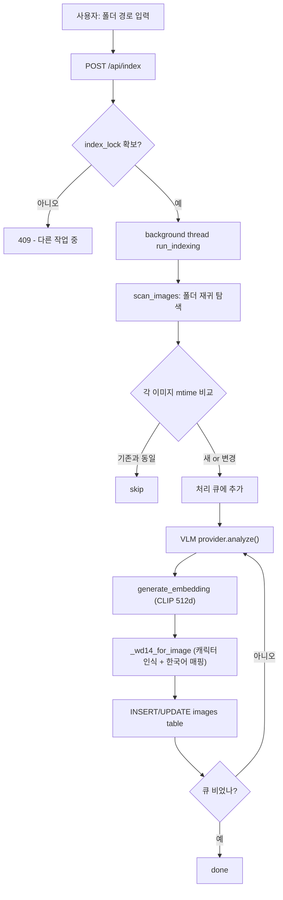
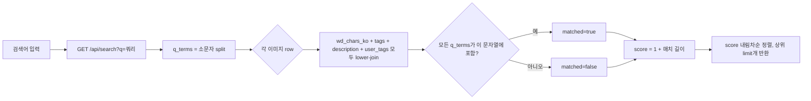
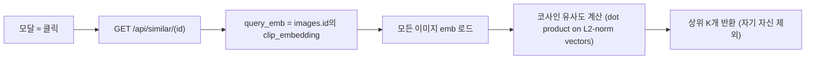
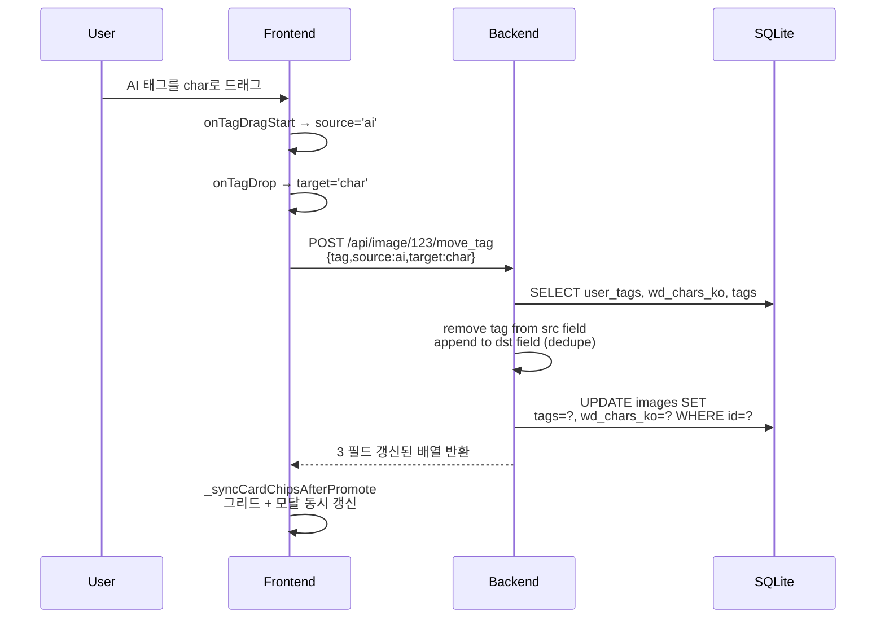

<div align="center">

# Yoink

**로컬에서 돌아가는 한국어 짤·이미지 라이브러리 자동 태깅 & 의미 검색 엔진**

GPU에서 직접 돌리는 VLM + CLIP 임베딩 + WD14 캐릭터 인식. 또는 OpenAI/Anthropic/Gemini API로 GPU 없이도 동작.

   

</div>

---

## 목차
- [무엇을 하는가](#무엇을-하는가)
- [핵심 기능](#핵심-기능)
- [아키텍처](#아키텍처)
- [데이터 파이프라인](#데이터-파이프라인)
- [기술 스택](#기술-스택)
- [모델 선택 가이드](#모델-선택-가이드)
- [설치 — 3가지 경로](#설치--3가지-경로)
- [사용법](#사용법)
- [API 레퍼런스](#api-레퍼런스)
- [설정 & 비용 추정](#설정--비용-추정)
- [트러블슈팅](#트러블슈팅)
- [한계 & 로드맵](#한계--로드맵)

---

## 무엇을 하는가

오랫동안 모아둔 짤·이미지·스크린샷 폴더를 자동으로 태깅하고, 한국어로 의미 검색 가능하게 만드는 로컬 도구.

```
사용자: D:\Download\그림\ 폴더 인덱싱
       ↓
Yoink: 각 이미지를 분석해서…
       ├─ WD14:     캐릭터/작품 인식 (애니/만화 캐릭터 매핑 사전 적용)
       ├─ Qwen VLM: 한국어 태그 5~10개 + 한 줄 설명 생성
       └─ CLIP:     512차원 시각 임베딩 (의미 검색용)
       ↓
브라우저 UI: "라프텔에서 본 그 짤" 같은 자연어 검색
            "비슷한 이미지 찾기" 한 번에 동일/유사 이미지 모음
            ★ 즐겨찾기, ✕ 숨김, 직접 태그 추가, 일괄 작업
```

설계 원칙:
- **로컬 우선** — DB·이미지·인덱스 전부 사용자 디스크. 클라우드 의존 0
- **한국어 일관성** — UI, 태그, 에러 메시지, 단축키까지
- **단일 사용자** — 인증/공유/멀티테넌트 없음. 본인 PC에서 본인이 씀
- **점진적 인덱싱** — 폴더 다시 추가하면 mtime 비교로 변경분만 처리

---

## 핵심 기능

### 1. 자동 태깅 (3계층)

```
┌────────────────────────────────────────────────────────┐
│  이미지 1장에 대해 동시에 3가지 분석                   │
├────────────────────────────────────────────────────────┤
│                                                        │
│   ┌─────────────────┐  ┌──────────────────┐           │
│   │  WD14 ONNX      │  │  Qwen2.5-VL VLM  │           │
│   │  (CPU)          │  │  (GPU 또는 API)  │           │
│   │                 │  │                  │           │
│   │  애니/만화      │  │  자유 형식       │           │
│   │  캐릭터 인식    │  │  한국어 태그+설명│           │
│   │  ~0.5s/장       │  │  ~2~5s/장        │           │
│   └────────┬────────┘  └────────┬─────────┘           │
│            │                    │                      │
│            ▼                    ▼                      │
│   wd_chars_ko: "리제로,        tags:    "이세계,      │
│      렘"                          마법사, 미소녀"     │
│                                description:           │
│                                "리제로의 렘이          │
│                                 미소짓는 일러스트"    │
│                                                       │
│   ┌─────────────────┐                                  │
│   │  CLIP ViT-B/32  │                                  │
│   │  (CPU/GPU)      │                                  │
│   │                 │                                  │
│   │  512d 시각      │                                  │
│   │  임베딩         │                                  │
│   └────────┬────────┘                                  │
│            ▼                                           │
│   clip_embedding: float32[512]                         │
│                                                        │
│   ⇨ SQLite (WAL 모드) 에 저장                          │
└────────────────────────────────────────────────────────┘
```

### 2. 3 종류 검색

| 모드 | 무엇 | 어떻게 |
|---|---|---|
| **텍스트 검색** | 검색창에 입력 | WD14/태그/설명/내 태그 텍스트에서 부분 매치. 한국어 IME 안전 (중복 검색 가드) |
| **랜덤** | `R` 키 또는 [랜덤] 버튼 | 5장 무작위. 탐색·발견용 |
| **유사 이미지** | 모달의 ≈ 버튼 | CLIP 코사인 유사도. "이 짤과 비슷한 거" |

### 3. 태그 인터랙션

- **드래그 이동** — 한 칩을 끌어다 다른 분류에 드롭. user ↔ char ↔ AI 3개 필드 사이 6방향 모두 가능
- **인라인 편집** — 더블클릭 → 텍스트 편집 → Enter
- **× 제거** — 칩 hover 시 나타나는 × 클릭
- **일괄 작업** — Ctrl+클릭/Shift+클릭으로 다중 선택 후 즐겨찾기/숨기기/태그 일괄 추가

### 4. AI 백엔드 선택

⚙ 설정 모달에서 4가지 중 선택:

| Backend | VRAM 요구 | 비용 | 비고 |
|---|---|---|---|
| **Local Qwen 7B FP16** | ~16GB | ₩0 | 최고 품질. RTX 4080/5080급 필요 |
| **Local Qwen 7B bnb-4bit** | ~6GB | ₩0 | 거의 동일 품질. RTX 3060/4060급도 OK |
| **Local Qwen 3B FP16** | ~7GB | ₩0 | 가벼움. 품질 살짝 낮음 |
| **OpenAI gpt-4o-mini** | 0 | ~₩4/장 | GPU 없이 동작. 100장 = ~₩400 |
| **Anthropic Haiku 4.5** | 0 | ~₩4/장 | 동일 |
| **Gemini 2.0 Flash** | 0 | 무료 티어 / 매우 저렴 | 가성비 최고 |

---

## 아키텍처

### 컴포넌트 다이어그램

```
┌─────────────────────────────────────────────────────────────────────┐
│                         사용자 (브라우저)                            │
│                  Edge --app  /  Chrome --app                        │
│                                                                     │
│  HTML/CSS/JS (vanilla, ~2300줄)                                     │
│  - 검색 / 그리드 / 모달 / 일괄작업 / 드래그태깅 / 설정모달           │
└─────────────────────────────────────────────────────────────────────┘
                                  ↓ HTTPS / HTTP (LAN)
┌─────────────────────────────────────────────────────────────────────┐
│                       FastAPI (Uvicorn)                             │
│                                                                     │
│  ┌──────────────────────────────────────────────────────────────┐   │
│  │  /api/index, /api/search, /api/random, /api/similar/{id},    │   │
│  │  /api/image/{id}/{state|tags|move_tag|field_tags},           │   │
│  │  /api/settings (GET/POST/test), /api/info, ...               │   │
│  └──────────────────────────────────────────────────────────────┘   │
└─────────────────────────────────────────────────────────────────────┘
        ↓                          ↓                        ↓
┌──────────────────┐    ┌──────────────────────┐  ┌─────────────────┐
│   providers.py   │    │   index.py / wd14    │  │   SQLite (WAL)  │
│                  │    │                      │  │                 │
│  ┌────────────┐  │    │  ┌───────────────┐   │  │  - images       │
│  │LocalQwen   │  │    │  │ WD14 ONNX     │   │  │  - folders      │
│  │ (FP16/bnb4)│  │    │  │ (CPU 추론)    │   │  │                 │
│  └────────────┘  │    │  └───────────────┘   │  │  schema 자동    │
│  ┌────────────┐  │    │  ┌───────────────┐   │  │  마이그레이션   │
│  │OpenAI      │  │    │  │ CLIP ViT-B/32 │   │  │                 │
│  │ Provider   │  │    │  │ (GPU/CPU)     │   │  └─────────────────┘
│  └────────────┘  │    │  └───────────────┘   │
│  ┌────────────┐  │    │                      │
│  │Anthropic   │  │    │  scan_images()       │
│  │ Provider   │  │    │  generate_embedding()│
│  └────────────┘  │    │  _wd14_for_image()   │
│  ┌────────────┐  │    │  backfill_*()        │
│  │Gemini      │  │    │  index_folder()      │
│  │ Provider   │  │    │                      │
│  └────────────┘  │    └──────────────────────┘
└──────────────────┘
        ↓
   외부 API
   (provider 선택 시)
```

### 디렉토리 구조

```
MemeTracker/
├── app.py                  # FastAPI 서버 + 모든 엔드포인트 (~1000줄)
├── index.py                # 인덱싱/백필/CLIP/디덥 헬퍼
├── providers.py            # VLMProvider 추상화 + 4종 구현
├── wd14_tagger.py          # WD14 ONNX 로더 + 한국어 alias 매핑
├── desktop.py              # dev 모드 데스크톱 런처 (subprocess + Edge)
├── yoink_main.py           # 패키지 모드 단일 프로세스 런처
├── tray_launcher.py        # 시스템 트레이 launcher
├── make_icon.py            # 아이콘 생성/캐싱
├── templates/
│   └── index.html          # 모든 프론트엔드 (HTML+CSS+JS, ~2300줄)
├── character_aliases.json  # WD14 영어 캐릭터 → 한국어 매핑
├── docs/                   # 한국어 설계 문서
├── settings.json           # AI provider 설정 (gitignore, 첫 실행 시 자동 생성)
├── images.db               # SQLite (gitignore)
├── yoink.spec              # PyInstaller 스펙
├── build.bat               # 패키지 빌드
└── requirements.txt
```

---

## 데이터 파이프라인

### 인덱싱 (새 폴더 추가)



### 검색 (텍스트)



### 유사 이미지



### 태그 이동 (atomic)



---

## 기술 스택

| 계층 | 선택 | 이유 |
|---|---|---|
| **VLM (로컬)** | Qwen2.5-VL-7B-Instruct | 한국어 태깅 능력. 멀티모달. AWQ/bnb 4bit 양자화 옵션 |
| **VLM (API)** | OpenAI / Anthropic / Gemini | GPU 없어도 동작 가능. SDK는 lazy import |
| **양자화** | bitsandbytes nf4 + double quant | 16GB → 5.5GB VRAM (Windows + Python 3.13에서 autoawq 대신 채택) |
| **임베딩** | CLIP ViT-B/32 (open_clip, laion2b) | 512d, 빠름, 한국어 텍스트와 시각 일치 충분 |
| **캐릭터 인식** | WD14 EVA02-Large (ONNX) | CPU 추론 가능, 애니/만화 캐릭터 5000+ 학습 |
| **DB** | SQLite (WAL 모드) | 단일 파일, 동시 read/write, 외부 의존 0 |
| **웹 서버** | FastAPI + Uvicorn | async, 자동 문서, Pydantic 검증 |
| **프론트엔드** | Vanilla HTML/CSS/JS | 빌드 단계 없음. 한 파일에서 다 보임 |
| **데스크톱 wrapping** | Edge / Chrome `--app` 모드 | Electron 없이 진짜 데스크톱 앱처럼 |
| **패키징** | PyInstaller (onedir, ~550MB) | Python 없는 사용자도 EXE 실행 |
| **HTTPS (LAN)** | mkcert 자체 서명 인증서 | LAN의 다른 기기(폰)에서 클립보드 API 사용 가능하게 |

---

## 모델 선택 가이드

### "내 GPU로 뭐 돌릴 수 있어?"

```
                  ┌─────────────────────────────────┐
                  │  내 GPU의 VRAM은?               │
                  └────────────┬────────────────────┘
                               │
              ┌────────────────┼────────────────┐
              │                │                │
              ▼                ▼                ▼
        ┌──────────┐     ┌──────────┐     ┌──────────┐
        │ GPU 없음 │     │ 4~7GB    │     │ 8GB+     │
        └────┬─────┘     └────┬─────┘     └────┬─────┘
             │                │                │
             ▼                ▼                ▼
        ┌──────────┐     ┌──────────┐     ┌──────────────┐
        │ API 모드 │     │ 7B bnb4  │     │ 12GB+: 7B    │
        │ (Gemini  │     │ 또는 3B  │     │ 8~12GB: 3B   │
        │  Flash)  │     │          │     │  또는 7B-bnb4│
        └──────────┘     └──────────┘     └──────────────┘
```

### 품질 vs 비용 비교 (대략)

| 모드 | 1000장 분석 비용 | 시간 | 품질 (0~10) | 비고 |
|---|---|---|---|---|
| Local 7B FP16 | ₩0 (전기료만) | ~50분 | 10 | RTX 4080+ 필요 |
| Local 7B bnb-4bit | ₩0 | ~70분 | 9.5 | RTX 3060+ |
| Local 3B FP16 | ₩0 | ~40분 | 8 | 가벼움 |
| OpenAI gpt-4o-mini | ~₩4,000 | ~25분 | 9 | API rate limit 주의 |
| OpenAI gpt-4o | ~₩25,000 | ~25분 | 9.5 | 비쌈 |
| Anthropic Haiku 4.5 | ~₩4,000 | ~30분 | 9 | |
| Gemini 2.0 Flash | ~₩0~500 | ~20분 | 8.5 | **가성비 1위** |

> **품질** = 한국어 태그 적절성 + 캐릭터 인식 + 묘사 정확도의 정성 평가 (n=20장 표본 기준)

---

## 설치 — 3가지 경로

### 경로 A: 패키지된 EXE 사용 (가장 쉬움, GPU 불필요)

1. [Releases](#)에서 `Yoink-vX.X.X-mid.zip` 다운로드 (~550MB)
2. 압축 풀기
3. `Yoink.exe` 더블클릭
4. ⚙ 설정 → Gemini/OpenAI 키 입력 → 저장
5. 폴더 인덱싱 시작

**제한:** AI 분석은 API 모드만. 로컬 GPU 모드 쓰려면 경로 B/C.

### 경로 B: 소스에서 (개발용, 전체 기능)

전제: Windows + Python 3.13 + NVIDIA GPU (RTX 30/40/50 시리즈)

```powershell
# uv 설치 (아직 없다면)
winget install astral-sh.uv

# 클론 & 환경 구축
git clone <repo>
cd MemeTracker
uv venv --python 3.13 .venv

# RTX 5080(Blackwell)이면 nightly torch 필요:
$env:VIRTUAL_ENV="$PWD\.venv"
uv pip install --index-url https://download.pytorch.org/whl/nightly/cu128 --pre torch torchvision

# 그 외 nVidia GPU:
# uv pip install --index-url https://download.pytorch.org/whl/cu124 torch torchvision

# 나머지 의존성
uv pip install -r requirements.txt

# mkcert 인증서 (LAN HTTPS 쓰려면)
# mkcert -install
# mkcert 192.168.0.75 127.0.0.1 ::1

# 실행
.venv\Scripts\python.exe desktop.py
```

### 경로 C: API 전용 (CPU만, 가벼움)

```powershell
git clone <repo>
cd MemeTracker
uv venv .venv-cpu
$env:VIRTUAL_ENV="$PWD\.venv-cpu"
uv pip install --index-url https://download.pytorch.org/whl/cpu torch torchvision
uv pip install fastapi "uvicorn[standard]" jinja2 open-clip-torch Pillow onnxruntime huggingface_hub openai anthropic google-genai numpy
.venv-cpu\Scripts\python.exe app.py
```

⚙ 설정에서 API provider 선택.

### EXE 빌드 (개발자용)

```powershell
# 빌드 venv 구축
uv venv .venv-build
$env:VIRTUAL_ENV="$PWD\.venv-build"
uv pip install --index-url https://download.pytorch.org/whl/cpu torch torchvision
uv pip install -r requirements.txt pyinstaller

# 빌드
.\build.bat
# 결과: dist\Yoink\Yoink.exe (~550MB onedir)
```

---

## 사용법

### 최초 1회

1. ⚙ 클릭 → 백엔드 선택 → (API면) 키 입력 → **테스트** 클릭으로 검증 → **저장**
2. ⋯ 클릭 (관리 도구 토글) → 폴더 경로 입력 또는 [폴더 고르기]
3. [새 이미지 추가] → 진행률 표시 → 완료 대기

### 평소 사용

- **검색**: 검색창에 한국어 입력 → Enter
- **랜덤 탐색**: `R` 키
- **상세 보기**: 카드 클릭 → 모달 → ←/→ 로 이동, Esc 닫기
- **즐겨찾기 / 숨김**: 카드 hover 시 ★/✕ 버튼
- **태그 편집**: 모달에서 칩 더블클릭 (편집) / 칩 드래그 (다른 분류로 이동) / × 클릭 (제거) / 입력란에 새 태그
- **일괄 작업**: Ctrl+클릭/Shift+클릭 → 하단 bulk-bar
- **비슷한 이미지**: 모달의 ≈ 버튼
- **복사**: 카드 hover 시 [복사] (로컬: 클립보드 직접 / 원격: 다운로드)

### 단축키

| 키 | 동작 |
|---|---|
| Enter | 검색 / 폴더 인덱싱 |
| R | 랜덤 5개 |
| ← / → | 모달 이전/다음 |
| Esc | 모달 닫기 |
| Ctrl+클릭 | 다중 선택 |
| Shift+클릭 | 다중 선택 |
| Ctrl+F5 | 강제 새로고침 |

---

## API 레퍼런스

베이스: `https://localhost:8000` (또는 `http://`)

### 인덱싱 / 분석

| Method | Path | 설명 |
|---|---|---|
| POST | `/api/index` | `{path, reindex, with_ai}` 폴더 인덱싱 시작 (백그라운드) |
| POST | `/api/backfill_wd14` | WD14 누락분만 채움 |
| POST | `/api/backfill_vlm` | AI 한국어 태그/설명 누락분 채움 |
| POST | `/api/relocalize` | character_aliases 갱신 후 한국어 매핑 재적용 (이미지 분석 X) |
| POST | `/api/dedupe_tags` | 모든 이미지의 중복 태그 정리 |
| GET | `/api/index/status` | 진행률 + 현재 상태 폴링 |

### 검색 / 브라우징

| Method | Path | 설명 |
|---|---|---|
| GET | `/api/search?q=&limit=&view=` | 텍스트 검색 (한국어 IME 안전) |
| GET | `/api/random?n=&view=` | 무작위 |
| GET | `/api/browse?offset=&limit=&view=` | 페이지네이션 브라우즈 |
| GET | `/api/similar/{id}?limit=&view=` | CLIP 유사 이미지 |
| GET | `/api/counts` | {all, favorite, hidden} |
| GET | `/api/info` | 전체 통계 (popover용) |

### 이미지 상태 / 태그

| Method | Path | 설명 |
|---|---|---|
| POST | `/api/image/{id}/state` | `{favorite?, hidden?}` |
| POST | `/api/image/{id}/tags` | `{tags: list[str]}` user_tags 전체 갱신 |
| POST | `/api/image/{id}/field_tags` | `{field, tags}` 임의 필드 갱신 (dedupe) |
| POST | `/api/image/{id}/move_tag` | `{tag, source, target}` user/char/ai 6방향 atomic 이동 |
| POST | `/api/image/{id}/copy` | (로컬 only) OS 클립보드에 이미지 복사 |

### 설정

| Method | Path | 설명 |
|---|---|---|
| GET | `/api/settings` | 설정 + 모델 카탈로그 + VRAM (API 키 마스킹) |
| POST | `/api/settings` | `{settings}` 저장 + 즉시 적용 (빈 키는 기존 유지) |
| POST | `/api/settings/test` | `{settings}` 1×1 더미 이미지 1회 호출로 검증 |

### 시스템

| Method | Path | 설명 |
|---|---|---|
| POST | `/api/restart` | exit 42 → 데스크톱 런처가 자동 재실행 |
| POST | `/api/open_log` | 로그 파일을 OS 기본 앱으로 열기 (로컬 only) |
| POST | `/api/pick_folder` | 폴더 선택 다이얼로그 (로컬 only) |
| GET | `/images/{path}` | 이미지 서빙 (등록된 폴더 안만 허용 — path traversal 방지) |
| GET | `/favicon.ico` | 아이콘 |

---

## 설정 & 비용 추정

### 1000장 분석 예상 비용 (2026.05 기준)

| Provider | 모델 | 평균 입력/이미지 | 입력가 (1M tok) | 출력가 | 1장당 | 1000장 |
|---|---|---|---|---|---|---|
| OpenAI | gpt-4o-mini | ~1.5K tok | $0.15 | $0.60 | ~$0.003 | **~$3** |
| OpenAI | gpt-4o | ~1.5K tok | $2.50 | $10.00 | ~$0.02 | ~$20 |
| Anthropic | Haiku 4.5 | ~1.5K tok | $1.00 | $5.00 | ~$0.004 | ~$4 |
| Anthropic | Sonnet 4.6 | ~1.5K tok | $3.00 | $15.00 | ~$0.01 | ~$10 |
| Gemini | 2.0 Flash | ~258 tok* | $0.10 | $0.40 | ~$0.0002 | **~$0.20** |
| Gemini | 2.5 Pro | ~258 tok | $1.25 | $5.00 | ~$0.001 | ~$1 |

\* Gemini는 이미지를 토큰으로 별도 계산 (1024×1024 미만은 ~258 토큰)

> 출력 토큰은 한국어 태그+설명 = 평균 ~80 토큰 가정. 실제 가격은 변동 가능 — 각 provider의 공식 가격을 참조.

### settings.json 예시

```json
{
  "provider": "gemini",
  "local": {"model_key": "qwen2.5-vl-7b-bnb4", "device": "cuda"},
  "openai": {"api_key": "sk-...", "model": "gpt-4o-mini"},
  "anthropic": {"api_key": "sk-ant-...", "model": "claude-haiku-4-5"},
  "gemini": {"api_key": "AIza...", "model": "gemini-2.0-flash"}
}
```

---

## 트러블슈팅

| 증상 | 원인 / 해결 |
|---|---|
| `NotSupportedError: togglePopover not supported on non-popover` | 브라우저 캐시. Ctrl+F5 |
| 헤더 아이콘이 안 보임 (서버 로그/재시작) | 개발자 모드 OFF. ⚙ → 하단 체크박스 |
| AI 분석 클릭 후 진행률 0 그대로 | 모델 다운로드 중일 수 있음. 첫 실행 시 10GB+ 다운로드 |
| API 모드에서 모든 이미지 에러 | 키 만료/한도 초과. ⚙ → [테스트]로 검증 |
| 모달 ←/→ 안 됨 | 검색창에 포커스 있을 때는 무시됨. 클릭으로 모달 영역 포커스 |
| 폰에서 [복사]가 다운로드로 동작 | 정상. 클립보드 API는 HTTPS + 보안 컨텍스트 필요 |
| 인덱싱 도중 멈춤 | 진행률 패널 우측 텍스트 확인. 보통 특정 이미지 파일 손상. Skip하고 다음 실행 |
| Edge --app 창에 변경사항 반영 안 됨 | Ctrl+F5. UI/CSS 변경은 새로고침만으로 충분 |

---

## 한계 & 로드맵

### 현재 한계

- **Windows 전용** — Edge/Chrome `--app` 모드, mkcert, 파일 경로 등 Windows 가정. macOS/Linux 미지원
- **단일 사용자** — 인증·계정·공유 없음. LAN 안의 다른 기기에서 접속은 가능하지만 권한 분리 X
- **한국어 우선** — UI/태그/프롬프트 전부 한국어. 영어 환경에서는 어색
- **애니/일러 편향** — WD14가 anime 데이터 학습이라 사진/실사 카테고리에서 캐릭터 인식 약함
- **AI 모드 단일 선택** — 한 모드로만 분석. 모드별 비교/하이브리드 X

### 단기 (도전 가치 있는 것)

- [ ] **인앱 가이드** (초등생 수준)
- [ ] **PWA + 모바일 뷰어** — 같은 LAN의 폰에서 접속해 보고 즐겨찾기
- [ ] **OS keyring 마이그레이션** — API 키를 settings.json 평문 대신 Windows Credential Manager에
- [ ] **모델별 결과 비교 모드** — 같은 이미지를 2개 모델로 분석 후 사용자가 선택

### 중기

- [ ] **Linux/macOS 지원** — Tauri 또는 webview2 alt
- [ ] **인덱싱 분산** — RTX 한 대로 인덱싱, 노트북에서 검색만
- [ ] **자동 백업** — 폴더 동기화 (rsync 스타일)
- [ ] **태그 통계 / 분석 대시보드** — 가장 많은 캐릭터, 빈 태그 패턴 등

### 장기 (별도 프로젝트가 더 어울리는 것)

- [ ] **클라우드 서비스** — 짤 검색 + 추천 피드 + 창작자 연결 (docs/ 폴더 참고)
- [ ] **모바일 네이티브 앱**
- [ ] **다국어 (영어/일본어 태그)** — 같은 이미지에 다국어 임베딩 동시 저장

---

## 라이선스 & 기여

- 코드: MIT
- 모델: 각 모델의 라이선스 따름 (Qwen2.5-VL = Apache 2.0, CLIP = MIT, WD14 = Apache 2.0)
- character_aliases.json은 fan-curated. 정정/추가 PR 환영

문제 발견 시 issue 또는 PR. 개인 프로젝트라 응답 지연 가능성 있음.

---

<div align="center">
Made by Vanillapapaya
</div>
