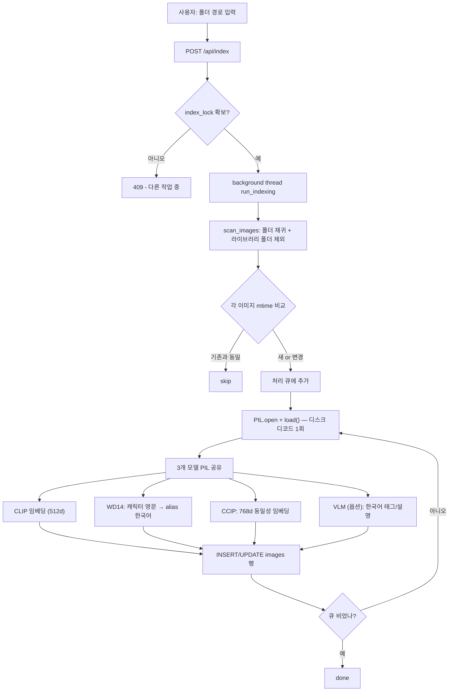
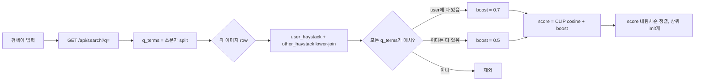
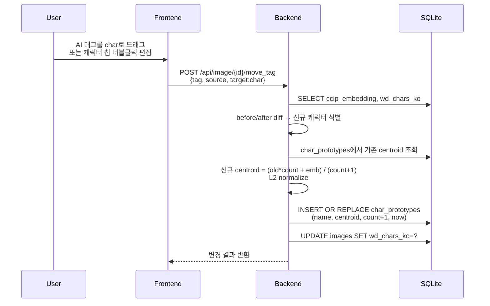
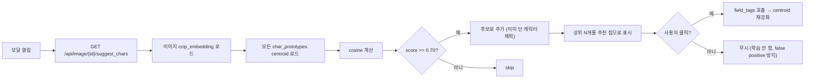
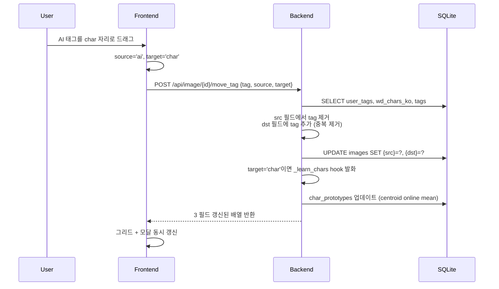
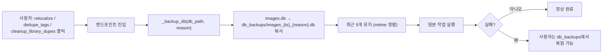

# 02 — 데이터 파이프라인

## 인덱싱 (새 폴더 추가)

**최적화 포인트:**
- 라이브러리 폴더(`*.library`, `*.eagle`, `*.aseprite-cache`, `*.thumbs`) 사전 제외 — Eagle 같은 앱이 사본 복사한 거 중복 인덱싱 방지
- PIL `Image.open + .load()` 1회 → 3개 ONNX/torch 모델이 같은 객체 재사용 → 디스크 디코드 비용 절약
- mtime 변경 없으면 skip — 점진적 인덱싱

## 검색 (텍스트)

**규칙:**
- 띄어쓰기 = AND (모든 단어 매치 필수)
- 내 태그(`user_tags`) 매치 시 다른 필드보다 가중치 ↑
- CLIP 유사도(0~1) + 텍스트 boost를 합한 score로 정렬

## 비슷한 이미지 (CLIP cosine)

200~5000장 규모에선 Python 루프로도 100ms 이내. 수만 장 이상이면 sqlite-vec / FAISS 도입 검토 (현재 미적용).

## 캐릭터 학습 (CCIP centroid)

### 학습 (사용자 행동 자동)

### 추론 (모달 진입 시 자동)

**임계값 근거:**
- CCIP 모델 메타데이터의 OPTICS eps = 0.18 (cosine distance) → cosine similarity ≥ 0.82 = 동일 캐릭터 강한 신호
- 실용적으론 0.70부터 추천 노출 (사용자가 판단)
- 자동 부착(write) 임계값 0.85+ 향후 검토

## 태그 이동 (atomic, 6방향)

## 데이터 안전 — DB 백업

위험 작업 직전 자동 스냅샷:

## 관련

- [[01-기술-아키텍처]] — 컴포넌트 구조
- [[03-API-명세]] — 각 엔드포인트 상세
- [[08-의사결정-기록]] — 왜 CCIP를 택했나, 왜 OPTICS eps 0.18인가
